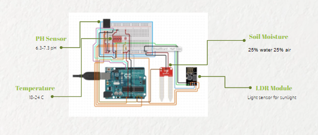
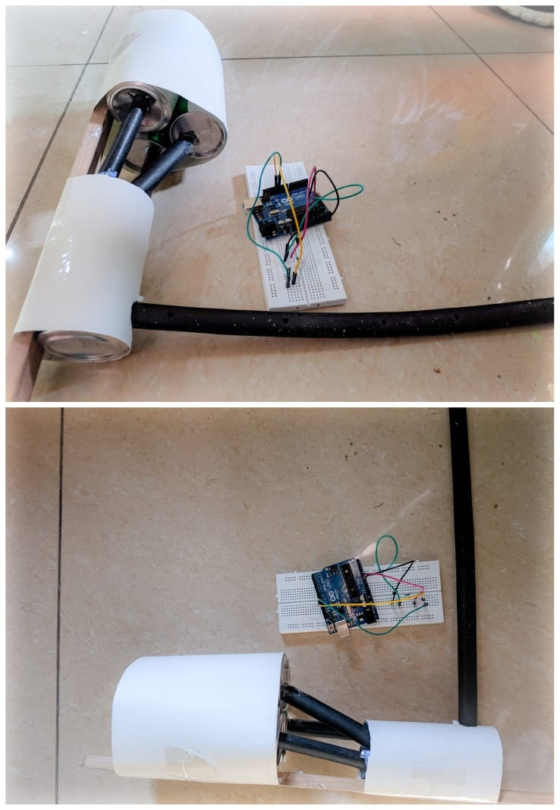

# MyCrop
Two step solution to all your home gardening problems.

# Features
1. Automated Nutrition Check for the plants while you're at work.
2. Regular fertilising to keep the plant and soil healthy.
3. Analysis of the crop for any possible disease.
4. Connect home crop grower and buyer near your area.

# Circuit Diagram

1. Circuit Blueprint

2. Drip irrigation for smooth flow of nutrition

